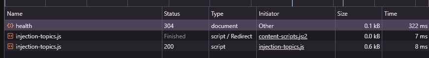
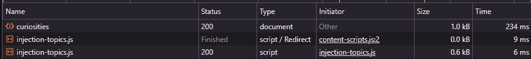
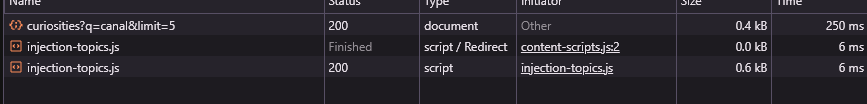
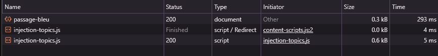

# Validation de l'API déployée — CP8_lanterne

## URL publique : https://cp-8-lanterne.vercel.app

Toutes les requêtes ci-dessous sont des GET exécutées depuis le navigateur (onglet Réseau des DevTools) contre l'API en production. Aucun token ni secret n'apparaît dans les captures.

## Tableau de validation
| # | Route | Méthode | Statut attendu | Statut obtenu | Preuve |
|---|-------|---------|-----------------|----------------|--------|
| 1 | `/api/health` | GET | 200 | 304 (voir note ci-dessous) | Capture DevTools — 0.1 kB, 322 ms |
| 2 | `/api/curiosities` | GET | 200 | 200 | Capture DevTools — 1.0 kB, 234 ms |
| 3 | `/api/curiosities?q=canal&limit=5` | GET | 200 | 200 | Capture DevTools — 0.4 kB, 250 ms |
| 4 | `/api/curiosities/passage-bleu` | GET | 200 | 200 | Capture DevTools — 0.3 kB, 293 ms |

## Note sur le statut 304 (/api/health)

Le premier appel affiche 304 Not Modified plutôt que 200. Ce n'est pas une erreur : le navigateur a mis la réponse en cache et le serveur confirme que le contenu n'a pas changé, donc aucun corps de réponse n'est retransmis.

**Health route result**

**Curiosities route result**

**Curiosities filter route result**

**Curiosities slug route result**
